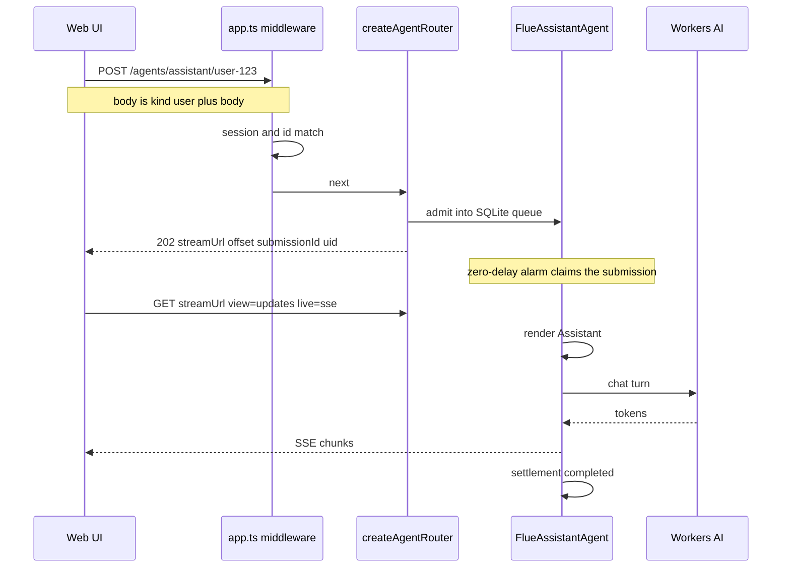
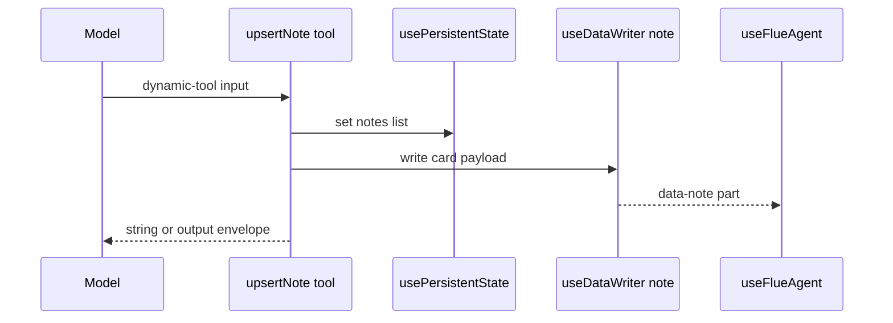
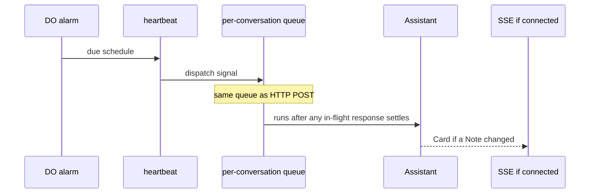
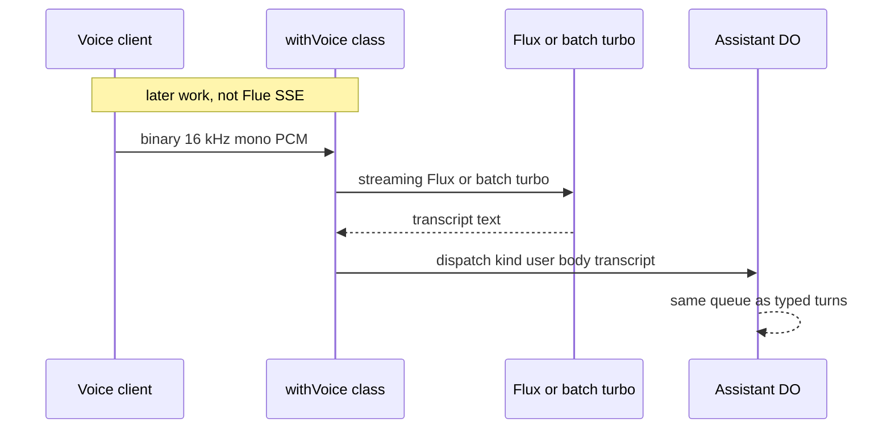

# How data moves through the assistant

This page explains the Flue 2.0 Cloudflare path. Build order lives in [plan.md](plan.md). Hook names, limits, and what not to mix live in [best-practices.md](best-practices.md).

This repo is still a Node stub. `src/` is not the Worker. The flows below are the product you scaffold with `@flue/cli`.

A draft that mixed live voice, invented wire parts, and a shared chat WebSocket into this path is wrong. The sections below are the corrected picture. Sources are listed at the end.

## Overview

One signed-in User maps to one Assistant instance. That instance is one SQLite-backed Durable Object. Hono names it with `instanceIdFor`, which returns `user-${userId}`. That string is an address. Origin is `initialData.userId` from the creating send.

The agent is a capitalized `'use agent'` function, `Assistant`. Flue compiles it to class `FlueAssistantAgent` and binding `env.FLUE_ASSISTANT_AGENT`. HTTP lives in `src/app.ts`. The Flue URL is `{mount}/{id}`, conventionally `/agents/assistant/user-123`.

A turn is admit, then run. `POST` durably queues a message and returns `202` before the model runs. Flue wakes the object on a zero-delay alarm and executes the full response there. The submitting connection observes. It does not own the work. Live follow is SSE, with long-poll as `live: 'long-poll'`. There is no Flue chat WebSocket.

The first client is a same-origin web UI on `@flue/react`. Notes are markdown only. Search is a TypeScript filter over the Notebook. One Review uses Agents SDK `scheduleEvery` via `extend({ base })`, then `dispatch()` a signal into the same Assistant instance.

Leave live voice, Vectorize, push, and native iOS until the web loop is boring. Voice is a later, separate Agents WebSocket path. It is not a part type on the Flue stream.

## Key concepts

**Identity.** The path segment is the instance address. This product derives it with `instanceIdFor` so Hono ownership is an equality check. Origin is `useInitialData().userId`. Do not parse User from the name. The storage identity is the agent function name, or an `agentName` static. Renaming `Assistant` without pinning `agentName` is a storage-identity change. Moving the mount path is not.

**Two HTTP envelopes.** Raw `POST /:id` body is a `DeliveredMessage`. User turns are `{ kind: 'user', body }`. Signals are `{ kind: 'signal', type, body, attributes?, tagName? }`. Optional siblings are `initialData` and `uid`. `@flue/sdk` `send()` takes `{ message: { kind, body } }`. Do not POST the SDK envelope as the raw body. Canonical sources are [Routing](https://flueframework.com/docs/guide/routing/) and [Streaming Protocol](https://flueframework.com/docs/reference/streaming-protocol/). The [migration page](https://flueframework.com/docs/guide/migration/) incorrectly shows the SDK envelope as the wire POST.

**Admission is the trust boundary.** A mounted agent has no auth. Hono middleware on `/agents/assistant/*` runs before `createAgentRouter`. Missing session cookie returns `401`. A caller whose session User does not match `instanceIdFor` returns `403`. A chat `POST` with `kind: 'signal'` returns `400`. After admission, Flue forwards a deterministic internal request. Original headers, cookies, query, URL, and body are not replayed into the Durable Object. Authenticate in the Worker, not in the agent function. Stamp Origin as `initialData.userId` from the session on the creating send.

**Queue and recovery.** Direct HTTP and `dispatch()` share one per-conversation queue. One submission runs at a time. Disconnect does not cancel. `POST /:id/abort` is conversation-scoped. It records a durable abort intent on every unsettled submission. Aborting the client's `fetch` does not stop agent work. Recovery is conservative. Flue requeues only when it can prove the input was not applied. Unresolved ordinary tool calls are not re-executed. They settle as unknown-outcome errors the model can see. `durable: true` tools plus `step.do` are the exception.

**Render.** The runtime runs `Assistant` before every model call. Hooks are render-time only. The function returns a string, the base instructions. There is no `useState`. Durable JSON is `usePersistentState`. Client cards are `useDataWriter`. Those names are render-identity invariant. The model never sees `data-*` parts.

**Wire parts.** `FlueConversationPart` is `text`, `reasoning`, `dynamic-tool`, `file`, and `` `data-${string}` ``. There is no `artifact`, `suggestion`, `audio`, or `transcript` part. Tool UI lives on `dynamic-tool`. Note cards are `data-note`.

**Durable Streams is a protocol, not a Cloudflare product.** Flue stores an append-only record log in the object's SQLite and speaks the Durable Streams HTTP protocol. Offset `-1` replays the whole conversation. Offsets address record batches, not messages. Treat them as opaque.

**One alarm.** A Durable Object has one `setAlarm` timestamp. Delivery is at-least-once, up to 6 retries, with no native repeat. Flue's response runner and Agents `schedule` or `scheduleEvery` multiplex that slot. Do not override `fetch`, `onRequest`, `onFiberRecovered`, or `alarm`. Do not add a Worker cron only to reach `scheduleEvery`.

**No `db.ts` on Cloudflare.** A source-root `db.ts` is a build error. The conversation stream, attachments, and submissions live in the owning object's SQLite. Application facts go in `usePersistentState`. Large blobs go in R2.

## Text turn



**Client.** `createFlueClient({ url, token })` or `useFlueAgent({ url })`. Methods are `send`, `wait`, `history`, `observe`, `abort`, and `attachmentUrl`.

**Routes** relative to the mount:

| Route | Role |
| --- | --- |
| `POST /:id` | Admit one message. Returns `202`. |
| `GET /:id` | Snapshot (`view=history`, default) or updates (`view=updates&offset=`). |
| `HEAD /:id` | Stream metadata headers. |
| `POST /:id/abort` | Abort in-flight and queued work. |
| `GET /:id/attachments/:attachmentId` | Attachment bytes. |

**202 body.** `{ streamUrl, offset, submissionId, uid }`. `offset` is the head after the admitted message. An updates read from that offset is the agent's reply, not a replay of history. Coordination headers are `Stream-Next-Offset`, `Stream-Up-To-Date`, and `Location`. Cross-origin CORS must expose those three.

**Reconnect.** Dropping SSE does not cancel the run. Re-GET from the last offset. Partial streamed `text` is best-effort. The completed canonical assistant message is authoritative.

## Notes

There is one artifact type, a markdown note. No charts, dashboards, or invented wire parts.



`usePersistentState` is JSON on the instance record log. It is not a SQL table. Reads are a render snapshot. Writes do not post a message, do not wake the agent, and do not re-render mid-run. A write from a tool commits atomically with that tool batch.

`useDataWriter('note', { schema })` returns a write-only function. The first write creates a `data-note` part. Later writes in the same response update that part in place. One writer name is one named part per response, not a list of cards. If a turn can create two Notes, write the Notebook as that `data-note` part or accept that the last write wins. Mounting emits nothing. Declare the same writer names on every render or Flue throws. The model never sees these parts. Tell it about notes through tool `output` or instruction text.

One Valibot tool covers create and update. `run` must return a string or `{ output?, terminate? }`. A bare object, array, number, boolean, or `null` throws.

**The stream is not the Notebook.** `usePersistentState` never appears on the wire. `data-note` parts sit on assistant messages. Compaction can emit `conversation-reset`. In Flue 2.0.3 that reset shortens the model prompt and does not drop older Cards from `history()`. Reconstruct the Notebook from the latest catalog-shaped `data-note`. Do not add a Notebook list GET.

**Size.** A Durable Object SQL string, BLOB, or row cannot exceed 2 MB. Keep bodies in persistent state while they are short. Slice 7 waits until a catalog write, or the Card that copies it, would strain that limit. Then put bytes at `userId/noteId/version` and point the Note with `body` XOR `{ version, r2Key }` plus a required `excerpt`. Serve one object through a cookie-authenticated Worker GET. S3 presigns work only on `*.r2.cloudflarestorage.com`, last at most 7 days, and do not work on custom domains.

**R2 writes.** Put bytes first under an idempotent key, then point the Notebook at that key. Prefer `durable: true` plus `step.do`. An ordinary tool that `put`s then crashes before the batch commits leaves an orphan object. Recovery will not re-run that tool.

## Search

First search is a tool, `searchRecent`, over this User's Notebook inside this Durable Object.

Keep a searchable Notebook in the object. Fields are `id`, `title`, `updatedAt`, and `body`. After Slice 7, `body` XOR `{ version, r2Key }` plus a required `excerpt`. Filter that map in TypeScript. That is enough for one User and a modest Note list.

Do not treat `usePersistentState` as a `LIKE` index. If you later query DO SQL yourself, `LIKE` and `GLOB` patterns are capped at 50 bytes.

After bodies move to R2, keyword search cannot see those bytes unless the Notebook still holds an excerpt or you fetch objects. A Worker invocation may hold 6 simultaneous outgoing connections waiting for headers. Fan-out to R2 is the wrong search plan.

Do not start with Vectorize. Writes become queryable after a WAL delay (median under 30 seconds). It is not the source of truth for the Notebook. Do not add D1. One User already has SQLite in this object.

When the Notebook outgrows one JSON value, add narrow app tables through `getCloudflareContext().storage.sql` in the same object. That is still not a source-root `db.ts`.

## Review

Flue has no scheduler. A Review is Agents SDK scheduling on the generated Durable Object:

```ts
import { extend } from '@flue/runtime/cloudflare';
import { dispatch } from '@flue/runtime';

export const cloudflare = extend({
	base: (Base) =>
		class extends Base {
			async onStart() {
				await this.scheduleEvery(60 * 60, 'heartbeat');
			}
			async heartbeat() {
				await dispatch(Assistant, {
					id: /* instanceIdFor address */,
					message: {
						kind: 'signal',
						type: 'schedule',
						body: 'Review recent notes. Prefer a new Note over updating an existing NoteId. Write a note if something is useful. Stay quiet otherwise.',
					},
				});
			}
		},
});
```

`scheduleEvery` is idempotent on callback name, interval, and payload. It is safe in `onStart`, which runs on every wake. Native SDK callbacks do not receive a Flue harness. They `dispatch` a signal like any other backend.



A callback that comes due mid-response waits until that response settles. Delivery is durable. Timeliness is not guaranteed while the agent is busy. Alarms are at-least-once. Make the handler idempotent.

`dispatch` bypasses HTTP middleware. That is correct for trusted Worker code. It means every other ingress (cron, a later voice class, an R2 download route) needs its own ownership check. Tools should trust Origin from `useInitialData()`, not a header that no longer exists and not a parse of the instance name. Hono derives the address with `instanceIdFor`.

**Do not make "a chat message appeared" the pass.** A scheduled signal is a submission. It occupies the single runner, renders into the model, and can steer into a live User turn. A useful Review writes or updates a Note and stays quiet unless there is something the User should see. `onStart` only runs after the Durable Object exists, so the first `POST` creates it. Review starts after first chat.

Worker `scheduled` in `src/cloudflare.ts` is for app-level cron that must fire whether or not this object is awake. Do not add a cron trigger merely to call `scheduleEvery`. `cloudflare.ts` must not export default `fetch`. HTTP stays in `app.ts`.

Cloudflare has no first-party Web Push or APNs product. A Review can write a Note. Reaching a locked phone is later, DIY work.

## Later voice, a separate path

Do not mix this onto Flue SSE.

`@cloudflare/voice` `withVoice(Agent)` is an Agents SDK class mixin. Transport is binary WebSocket, 16 kHz mono 16-bit PCM. Official defaults are `WorkersAIFluxSTT` (`@cf/deepgram/flux`) for `withVoice`, `WorkersAINova3STT` (`@cf/deepgram/nova-3`) for `withVoiceInput`, and `WorkersAITTS` (`@cf/deepgram/aura-1`). Aura-2 exists as `@cf/deepgram/aura-2-en` and `aura-2-es`. It is not the mixin default. ElevenLabs and Cartesia are third-party keys, not hosted defaults.

`withVoice` on a Flue-generated Durable Object fights Flue-owned `fetch` and `alarm`. Voice `keepAlive` also uses the alarm slot. Do not subclass `FlueAssistantAgent` to add a mic.

Two later products, both after slice 6 is solid:

1. **Batch voice in.** Upload a clip. Transcribe with Workers AI `@cf/openai/whisper-large-v3-turbo`. `dispatch` the transcript as `{ kind: 'user', body: text }` into `Assistant`. Turbo is batch ASR. It is not the `withVoice` streaming path. Published I/O is `text`, `segments`, `word_count`, and `vtt`. It does not take OpenAI `word_timestamps` or `timestamp_granularities`. Older `@cf/openai/whisper` documents a `words[]` array.

2. **Live voice.** A separate Agents class with `withVoice`, its own Durable Object, its own WebSocket. Treat it as I/O. `dispatch` the transcript into `Assistant` so notes and history stay in one place. Do not hang that socket on `useFlueAgent`. Do not let `onTurn` become a second brain with a second note store.



Word highlighting is not a freebie. Deepgram's own Flux API added per-word `start` and `end` in July 2026. Required fields remain `word` and `confidence`. Inspect a live hosted `@cf/deepgram/flux` payload before you build UI on timestamps. Do not assume Cloudflare's schema matches Deepgram's changelog on day one.

## Storage

| Fact | Store | Notes |
| --- | --- | --- |
| Canonical conversation stream, settlements, `flue_meta` | DO SQLite (Flue-owned) | Clients see snapshots and update chunks, not raw records |
| Accepted submissions and abort intents | Same DO SQLite | One terminal outcome per admission: `completed`, `failed`, or `aborted` |
| Image attachments | DO SQLite plus `GET /:id/attachments/:id` | `file` parts. `url` is resolved client-side |
| Note (`id`, `title`, `updatedAt`, `body`; later `body` XOR `{ version, r2Key }` plus `excerpt`) | `usePersistentState` while small, then optional app SQL in the same DO | Instance-scoped. 2 MB per SQL value |
| Large note bodies | R2 `userId/noteId/version` | Serve via Worker. Presign max 7 days on `*.r2.cloudflarestorage.com` |
| Agents schedules | `cf_agents_schedules` in the same DO | Multiplexed onto one alarm |
| Vector embeddings | Vectorize, later | WAL delay. Never source of truth for "what I just said" |
| D1 | None | One user, one DO |
| Push tokens | Later, app-owned | No first-party Cloudflare push product |
| Sandbox files | Not durable by default | In-memory bash is ephemeral |

Limits that shape the app: paid 10 GB SQLite per object (free 1 GB per object, 5 GB account). Alarm, cron, and queue wall time 15 minutes. CPU 30 seconds default, raise with `limits.cpu_ms`, max 5 minutes on Paid. Isolate memory 128 MB. 6 simultaneous outgoing connections waiting for headers.

## Where things live

| Path | Role |
| --- | --- |
| This repo `src/agent.ts`, `src/flue.ts`, `src/run.ts` | Node stub. Do not grow it into the Worker. |
| This repo `plan.md` | How-to slices 1 to 9 plus later work. |
| This repo `best-practices.md` | Hook names, limits, mix-bans. |
| Scaffolded `src/agents/assistant.ts` | `'use agent'` `Assistant` plus `export const cloudflare = extend(...)`. |
| Scaffolded `src/app.ts` | Hono auth, then `createAgentRouter(Assistant)`. |
| Scaffolded `src/cloudflare.ts` | Extra DO classes, `scheduled`, queues. No default `fetch`. |
| Scaffolded authored `wrangler.jsonc` | Name, `compatibility_date`, append-only `new_sqlite_classes: ["FlueAssistantAgent"]`. Do not hand-author `FLUE_*` bindings. |

## Gotchas

1. The [migration page](https://flueframework.com/docs/guide/migration/) shows the SDK envelope as a raw POST. The wire body is `{ kind, body }`.
2. Auth dies at admission. Stamp Origin on the creating send. Put the `instanceIdFor` address into `dispatch({ id })`.
3. Abort is coarse. `POST /:id/abort` kills the running submission and everything queued, including Reviews.
4. One alarm, two tenants. Flue's runner and `scheduleEvery` share it. A Review during a long turn waits.
5. `useDataWriter` names are identity. Adding or removing a writer between renders throws.
6. Tool `run` envelope. `{ status: 'ok' }` throws. Return `{ output: { status: 'ok' } }` or `'ok'`.
7. One `user-${userId}` object is also abort scope, Review scope, search scope, and stream-replay cost. Threads later need a second id scheme and a store Notes can share. Do not start with both. Keep Notes on Origin so they are not trapped in one chat transcript.
8. `createCloudflareTracing()` is installed by default. `@flue/opentelemetry` is a separate package that does not configure an exporter.
9. Flue stamps `flue_meta`. There is no in-place format migration. An older binary will not open a newer Durable Object database.
10. `kimi-k2.6` needs Workers Paid or AI Gateway credits. Default is 20 requests per minute. Local `wrangler dev` still bills inference.

## Claim check

These are the pasted notes, scored against Flue 2.0 and Cloudflare docs.

| Claim | Verdict | Correction |
| --- | --- | --- |
| Chat is a WebSocket to the agent | Contradicted | Live transport is SSE, fallback long-poll. |
| POST `{ message: { kind, body } }` as raw HTTP | Contradicted | Wire POST is `{ kind, body }`. SDK `send()` wraps `message`. |
| `202` returns `streamUrl`, offset, submission id | Confirmed | Also `uid`. |
| Disconnect cancels the run | Contradicted | Admission owns the work. |
| Abort is per-submission | Contradicted | `POST /:id/abort` is conversation-scoped. |
| Auth headers flow into the Durable Object | Contradicted | Authenticate in Hono before admission. |
| Cloudflare target uses `db.ts` | Contradicted | Source-root `db.ts` is rejected. |
| Agent function is a long-lived process | Contradicted | It re-renders before every model call. |
| Wire parts include artifact, suggestion, audio, transcript | Contradicted | Only `text`, `reasoning`, `dynamic-tool`, `file`, `data-*`. |
| Notes are a special artifact channel | Contradicted | `usePersistentState` plus `useDataWriter('note')` plus one Valibot tool. |
| `usePersistentState` is a searchable table | Contradicted | JSON record-log API. |
| Tool `run` can return a bare object | Contradicted | String or `{ output?, terminate? }`. |
| Flue has a built-in scheduler | Contradicted | `extend({ base })` plus `scheduleEvery`, or Worker `scheduled` plus `dispatch`. |
| Override `alarm` for wakes | Contradicted | Do not override `fetch`, `onRequest`, `onFiberRecovered`, `alarm`. |
| Add Worker cron to get `scheduleEvery` | Contradicted | Cron is for app-level dispatch. |
| Need D1 for one user | Contradicted | One Durable Object is the store. |
| Need Vectorize for v1 search | Later | Keyword plus timestamps in the object first. |
| Durable Streams is a Cloudflare product | Contradicted | Open HTTP protocol. Flue implements it on Durable Object SQLite. |
| First client is iOS or React Native | Contradicted | First client is web `@flue/react`. iOS is later. React Native is never mentioned. |
| This repo is the Worker | Contradicted | Stub CLI `NotesAgent`. Scaffold elsewhere. |
| Live voice rides the Flue stream | Contradicted | Separate Agents WebSocket. |
| `withVoice` wraps the Flue function | Contradicted | Class mixin on Agents `Agent`. Fights Flue `fetch` and `alarm`. |
| Streaming STT is Whisper turbo | Contradicted | Turbo is batch. Streaming default is Flux. |
| Turbo takes `word_timestamps` | Contradicted | Published params have no such flag. |
| Default TTS is Aura-2, ElevenLabs, or Cartesia | Contradicted | Default is Aura-1. |
| R2 presigns on a custom domain, long-lived | Contradicted | `*.r2.cloudflarestorage.com` only, max 7 days. |
| Cloudflare ships Web Push or APNs | Contradicted | No first-party product. |
| SQL values can be large. Alarms repeat natively | Contradicted | 2 MB per value. One alarm timestamp, at-least-once, no native repeat. |

## Sources

Checked 2026-09-05.

- [Cloudflare target](https://flueframework.com/docs/guide/cloudflare-target/)
- [Streaming protocol](https://flueframework.com/docs/reference/streaming-protocol/)
- [Routing](https://flueframework.com/docs/guide/routing/)
- [Durability](https://flueframework.com/docs/guide/durability/)
- [Schedules](https://flueframework.com/docs/guide/schedules/)
- [Agent Hooks API](https://flueframework.com/docs/reference/agent-hooks-api/)
- [Deploy on Cloudflare](https://flueframework.com/docs/ecosystem/deploy/cloudflare/)
- [Voice](https://developers.cloudflare.com/agents/communication-channels/voice/)
- [Durable Object limits](https://developers.cloudflare.com/durable-objects/platform/limits/)
- [Durable Object alarms](https://developers.cloudflare.com/durable-objects/api/alarms/)
- [R2 presigned URLs](https://developers.cloudflare.com/r2/api/s3/presigned-urls/)
- [Vectorize insert / WAL](https://developers.cloudflare.com/vectorize/best-practices/insert-vectors/)
- [Workers AI whisper-large-v3-turbo](https://developers.cloudflare.com/workers-ai/models/whisper-large-v3-turbo/)
- [Workers AI Flux](https://developers.cloudflare.com/workers-ai/models/flux/)
- [Deepgram Flux word timestamps changelog](https://developers.deepgram.com/changelog/2026/7/2.md)
